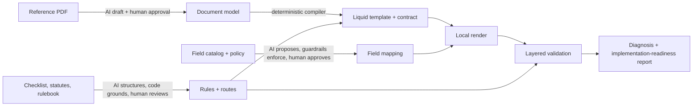

# AI-assisted Socotra dynamic documents: a prototype

A prototype exploring how AI could reduce the manual effort in Socotra dynamic-document implementations. It covers four implementation workstreams, end to end, on a real Florida homeowners declarations page:

1. **Template generation:** reference PDF → approved document model → deterministic Liquid template.
2. **Data mapping:** template fields → Socotra-shaped data paths, with guardrails.
3. **Rule abstraction:** regulator checklists, statutes, and carrier rulebooks → provenance-linked rules, routed to where they're implemented.
4. **Validation:** layered checks that say which upstream layer probably caused each failure, rolled into an implementation-readiness report.

The design rule: **AI interprets, deterministic code compiles and checks, and a person approves.** A model never writes the template, never uses a data path the catalog doesn't contain, and never approves its own output.

> This is a prototype, not a production system and not a legal or compliance tool. Rules are candidates for legal review, and a PASS means "the evidence checked here agrees", not "compliant". Nothing calls a Socotra tenant; the renderer is a local stand-in.

<table>
<tr><th>Reference (Florida CFO sample)</th><th>Generated candidate (local render)</th></tr>
<tr><td></td><td></td></tr>
</table>

## The problem

A Socotra document implementation is mostly translation work: read a carrier's existing form, express it as a Liquid template, map every field to the product's data model, work out which regulatory and carrier rules govern the document, and prove the result is right. Each step is manual, and errors surface late, in rendered PDFs, with no pointer to which step went wrong. The prototype asks where AI can take on the reading and drafting, while keeping the parts that must be exact deterministic and reviewable.

## How it works



| Step | AI does | Deterministic code does | A person does |
|---|---|---|---|
| PDF → document model | Drafts the model from text and page image | Structure review, schema validation | Approves the model |
| Model → Liquid | nothing | Compiles template and rendering contract | nothing |
| Fields → data paths | Picks a path and transform from a shortlist | Catalog guardrails, transform trial runs | Approves each mapping |
| Sources → rules | Triages and structures requirements | Citation, statute and applicability grounding | Review decisions, route approval |
| Validation | Optional semantic and visual review | Every other check, the diagnosis, the readiness report | Signs off on layout and open REVIEW items |

Details: [docs/architecture.md](docs/architecture.md).

## Quick start

Requires Python 3.12. The tests and the default pipeline make no model calls and need no API key.

```bash
python3.12 -m venv .venv
.venv/bin/pip install -r requirements.txt

.venv/bin/pytest -q                                  # 76 offline tests
.venv/bin/python src/pipeline.py generated           # valid Florida run, deterministic checks only
.venv/bin/streamlit run app.py                       # interactive demo
```

Each run writes a folder under `runs/` (git-ignored): inputs, analysis, template and rendering contract, mapping, rules, Socotra-shaped config and Java sketches, the candidate PDF, `validation/*.json`, a per-run `ASSUMPTIONS.md`, and `implementation-readiness.{json,md}`.

The AI paths need an OpenAI key: `cp .env.example .env`, then set `LLM_PROVIDER=openai`, `LLM_MODEL=gpt-4.1` and `OPENAI_API_KEY`.

```bash
.venv/bin/python src/pipeline.py generated --review                        # plus semantic and visual review (2 calls)
PYTHONPATH=src .venv/bin/python src/analysis/form_analyzer.py              # draft a document model from the Florida PDF
PYTHONPATH=src .venv/bin/python src/demo/failures.py                       # full failure matrix (~25 calls)
PYTHONPATH=src .venv/bin/python src/demo/live_acceptance.py                # live acceptance pass (~12 calls)
PYTHONPATH=src .venv/bin/python src/demo/second_form.py                    # New York sample, no NY tuning
PYTHONPATH=src .venv/bin/python src/rules/regulatory_workflow.py review    # re-ground saved regulatory extraction, no calls
```

## Demo path

1. **Valid run.** Run `streamlit run app.py`, keep the `golden` scenario, and click "Generate template, render, and validate". The Template tab shows the render next to the reference, and the Validation tab shows every deterministic check passing. The run folder's `implementation-readiness.md` reports REVIEW_REQUIRED, not READY, because open regulatory decisions still need a person. [Example report](docs/examples/implementation-readiness.md).
2. **Break it.** Pick `mapping_transform_wrong`, `hurricane_premium_dropped`, or `legislative_discounts_window`. Each lands in a different diagnostic layer: data mapping, template, and regulatory/rule routing. See [docs/failure-scenarios.md](docs/failure-scenarios.md).
3. **Show the AI boundary.** Draft a document model from the PDF, or turn on the AI mapping proposal: the AI output is a draft with review flags, and approving it blindly is blocked by deterministic checks.

## Results

**Valid Florida run** ([full report](docs/examples/implementation-readiness.md)):
- 31 of 31 mappings resolved, all deterministic checks pass.
- 17 regulatory rules normalize to 19 rules with 38 routes (10 approved).
- Validation obligations: 17 VERIFIED, 14 REVIEW, 32 NO_VALIDATOR, 2 NOT_APPLICABLE. An obligation with no validator stays NO_VALIDATOR, never verified.

**Live AI evaluation** (gpt-4.1, [details](docs/live-ai-acceptance.md)):
- Semantic and vision review raised no false positives on the valid render, and semantic review caught the missing section and the swapped premiums (the swap was labelled `value_mismatch` rather than `wrong_association`).
- Vision missed a cramped-table layout defect in all seven recorded runs; layout still needs human sign-off.
- Across three fresh AI mapping runs: no invented catalog paths, 28 of 31 fields matching the approved mapping each time, and one formatting error with no review flag, which the deterministic format check caught. Approving each proposal blindly was BLOCKED every time.
- Live carrier-rule extraction produced the contradictory rule, and the deterministic evaluator reported the conflict.
- The AI document-model draft passed structure review and compiled. Rendering it unapproved was BLOCKED.

**Second form.** The New York DFS sample ran through the same analyzer and generator with no New York tuning. It exposed Florida overfitting in the first prompt (since fixed) and showed that reuse across forms needs a shared concept vocabulary, which led to the concept layer in [docs/concept-crosswalk.md](docs/concept-crosswalk.md).

## Known limitations

- One reference document; the golden expectation is human-authored from that PDF.
- The generated pipeline starts from an approved document model. The AI drafting step runs separately and its output is reviewed before use.
- No live Socotra calls. The Java plugin sketches are uncompiled, the Liquid `data` root is a convention to verify in a tenant, and the local renderer is not Socotra's.
- There are no validators for calculation or rating correctness, document-selection correctness for regulatory routes, or form versions. The readiness report shows these as NO_VALIDATOR.
- LLM output varies even at temperature 0. Extraction output is saved and re-grounded deterministically, and the offline tests never call a model.
- The Florida checklist is a filing aid that "may not contain all of the requirements"; traceability is evidence, not a compliance finding.

[ASSUMPTIONS.md](ASSUMPTIONS.md) lists every assumption.

## Repository map

| Path | What's there |
|---|---|
| `src/analysis/` | AI document-model drafting, structure review, concept review |
| `src/templates/` | Deterministic Liquid generator and renderers |
| `src/mapping/` | Candidate matching, AI mapper and guardrails, transform DSL, snapshot sketch |
| `src/rules/` | Checklist parsing, regulatory extraction and grounding, applicability, traceability, provenance, routing, carrier rules |
| `src/validation/` | Deterministic, semantic and visual validators, diagnosis |
| `src/bundle/` | Per-run assumptions, export bundle, implementation-readiness report |
| `src/demo/` | Failure scenarios, live acceptance harness, second-form test |
| `src/pipeline.py`, `app.py` | End-to-end pipeline and Streamlit demo |
| `sample/` | Reference PDFs, approved model and mapping, golden values, rules, statute cache ([sources](sample/SOURCES.md)) |
| `tests/` | 76 offline tests |
| `docs/` | Architecture, failure scenarios, live evaluation, research write-ups, example report |
| `research/` | Concept crosswalk and rule-routing audit data, with their generators |
| `references/` | Source manifest for the research corpus (URLs and classifications; files not redistributed) |

## Research write-ups

- [Research findings](docs/research-findings.md): what each public artifact in the corpus can and can't inform.
- [Artifact role matrix](docs/artifact-role-matrix.md): authority and best use of each artifact.
- [Architecture impact](docs/architecture-impact.md): design changes the corpus supports.
- [Concept crosswalk](docs/concept-crosswalk.md): a thin canonical concept layer between forms and Socotra paths.
- [Rule routing audit](docs/rule-routing-audit.md): classifying rules by class, implementation sink, and validation obligation.

## License

MIT for the code and documentation (see [LICENSE](LICENSE)). The public government documents under `sample/` keep their publishers' terms ([sample/SOURCES.md](sample/SOURCES.md)).
