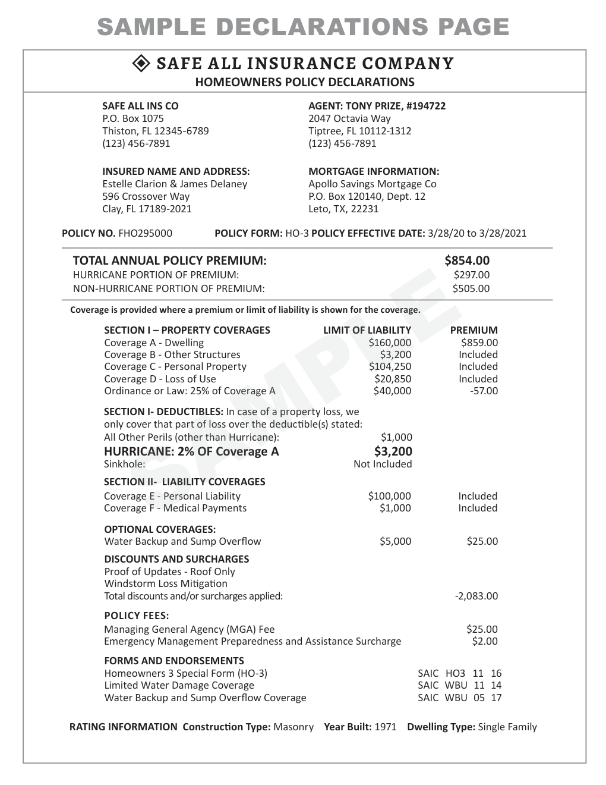
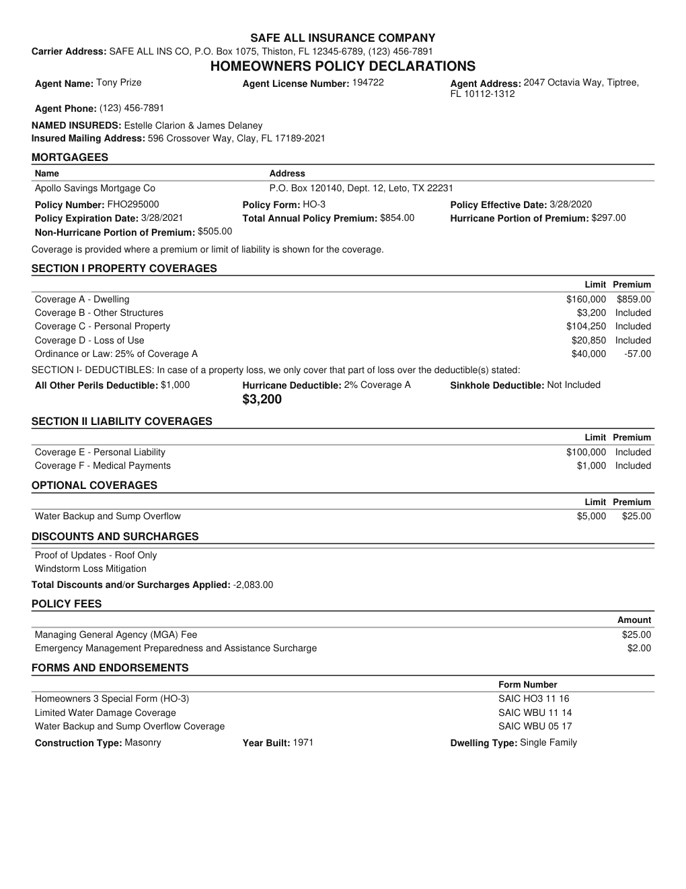
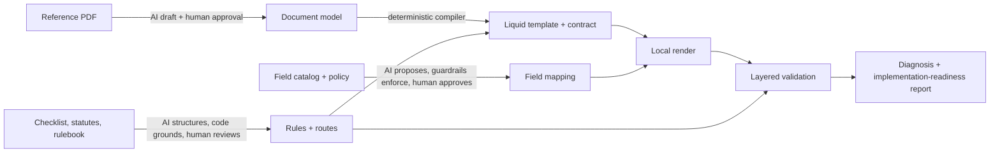
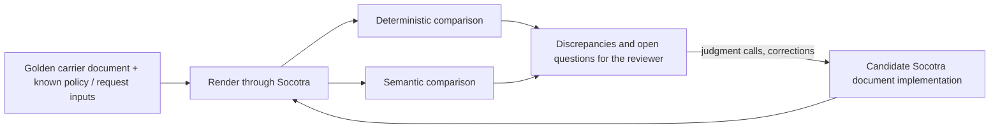

# AI-assisted Socotra dynamic documents: a prototype

A prototype exploring how AI could reduce the manual effort in Socotra dynamic-document implementations. It was built from Socotra's public documentation, without access to a live Socotra tenant. It covers four implementation workstreams, end to end, on a real Florida homeowners declarations page:

1. **Template generation:** reference PDF → approved document model → deterministic Liquid template.
2. **Data mapping:** template fields → Socotra-shaped data paths, with guardrails.
3. **Rule abstraction:** regulator checklists, statutes, and carrier rulebooks → provenance-linked rules, routed to where they're implemented.
4. **Validation:** layered checks that say which upstream layer probably caused each failure, rolled into an implementation-readiness report.

The design rule: **AI interprets, deterministic code compiles and checks, and a person approves.** A model never writes the template, never uses a data path the catalog doesn't contain, and never approves its own output.

> This is a prototype, not a production system and not a legal or compliance tool. Rules are candidates for legal review, and a PASS means "the evidence checked here agrees", not "compliant". Nothing calls a Socotra tenant; the renderer is a local stand-in. It is not a replacement for Socotra's Configuration Assistant, Public Skills, Config SDK, document stack, or renderer; see [Platform context](#platform-context-native-socotra-tooling).

<table>
<tr><th>Reference (Florida CFO sample)</th><th>Generated candidate (local render)</th></tr>
<tr><td></td><td></td></tr>
</table>

## The problem

A Socotra document implementation is mostly translation work: read a carrier's existing form, express it as a Liquid template, map every field to the product's data model, work out which regulatory and carrier rules govern the document, and prove the result is right. Each step is manual, and errors surface late, in rendered PDFs, with no pointer to which step went wrong. The prototype asks where AI can take on the reading and drafting, while keeping the parts that must be exact deterministic and reviewable.

## Platform context: native Socotra tooling

Socotra released **Configuration Assistant** on September 23, 2026, after this prototype was substantially complete. According to Socotra's [launch announcement](https://www.businesswire.com/news/home/20260923464259/en/), it is a native AI-assisted workflow in Configuration Studio for turning product requirements into Socotra configuration:

- Users start from natural language, an uploaded filing, or an existing configuration.
- It proposes assumptions where requirements are incomplete, and builds the data model, business logic, and rating model in conversation.
- Business users review the product through visual views and summaries. Technical users can inspect the underlying configuration and plugin code.
- It validates the result and deploys it to a new or existing tenant for testing and quoting, with human approval kept in the process.

**Socotra Public Skills** ([socotra/socotra-skills](https://github.com/socotra/socotra-skills)) are another agent-based path for supported configuration and plugin workflows. That repository explicitly lists document templates as out of scope.

**Unresolved capability boundary.** Public material did not make clear whether Configuration Assistant can already take a reference or golden carrier document and produce a dynamic Liquid/Velocity document template. This README treats that as an open question, not as a claim that the capability is absent.

**How this prototype should be read.** It explored the right implementation problem, but it is not a substitute for native tooling. In a real implementation, the recommendation is:

1. Use native Socotra capabilities wherever they already cover the workflow.
2. Confirm what native document-template authoring can do.
3. Add document-authoring functionality only where a verified gap remains.

If Configuration Assistant already supports reference-document-to-template generation, use it instead of this prototype's authoring step (document model drafting and the Liquid compiler). The most defensible additive contributions are document-specific authoring where a verified gap remains, and the automated document-parity review described below, which augments the human approval step rather than replacing it. The evidence-based readiness reporting supports both.

## How it works



| Step | AI does | Deterministic code does | A person does |
|---|---|---|---|
| PDF → document model | Drafts the model from text and page image | Structure review, schema validation | Approves the model |
| Model → Liquid | nothing | Compiles template and rendering contract | nothing |
| Fields → data paths | Picks a path and transform from a shortlist | Catalog guardrails, transform trial runs | Approves each mapping |
| Sources → rules | Triages and structures requirements | Citation, statute and applicability grounding | Review decisions, route approval |
| Validation | Optional semantic and visual review | Every other check, the diagnosis, the readiness report | Signs off on layout and open REVIEW items |

Details: [docs/architecture.md](docs/architecture.md).

## The additive proposal: augmented document-parity review

Whether a candidate document template is authored by Configuration Assistant or by an additive workflow, the strongest reusable concept in this repository is the **document-parity review loop**:



1. Start from a representative golden carrier document and the policy or request inputs that produced it.
2. Take the candidate Socotra document implementation, however it was authored.
3. Render the corresponding output through Socotra's document-generation path. This prototype uses a local renderer in place of that step.
4. Run deterministic comparisons: values, required text, formatting where it's material, counts and repeating records, and explicit contracts such as every template key having data.
5. Run semantic comparisons for concept-level problems that presence checks can't see.
6. Give the human reviewer the discrepancies and open questions. The reviewer resolves the judgment calls, corrects the implementation, and reruns.

The aim is to front-load the mechanical part of review so the reviewer's time goes to judgment. It does not remove human approval. The Coverage A / Coverage B example shows why both layers matter: with the two premiums swapped, every value is still on the page, so value-presence checks pass. The deterministic row-association check and the semantic reviewer both flag it, and the semantic reviewer described the swap in plain language. In this prototype the loop runs through `validation/generated.py` (deterministic), `validation/semantic.py` and `validation/visual.py` (model-assisted), and `validation/diagnosis.py` plus the implementation-readiness report (routing findings to a likely layer).

## Conceptual Configuration Assistant integration

Configuration Assistant's internal extension model was not publicly available during this exercise, so this section describes a capability boundary, not an integration design.

| Capability | What it covers |
|---|---|
| **Inputs** | The reference or golden document; the relevant carrier requirements; the current tenant and product configuration |
| **Authoring** | Interpret the reference artifact; propose or create the document and template resources and data bindings, only where native capability does not already exist |
| **Execution** | Stage or deploy the candidate implementation; render representative scenarios through Socotra's actual document-generation path |
| **Review** | Compare the rendered document with the golden artifact using deterministic and semantic checks; return discrepancies and unresolved questions to the human reviewer |

If Configuration Assistant is extended internally through tools or skills, these capabilities could be exposed that way. If it uses another internal service or interface model, the same input and output contracts still apply. This README does not assume either.

## Quick start

Requires Python 3.12. The tests and the default pipeline make no model calls and need no API key.

```bash
python3.12 -m venv .venv
.venv/bin/pip install -r requirements.txt

.venv/bin/pytest -q                                  # 76 offline tests
.venv/bin/python src/pipeline.py generated           # valid Florida run, deterministic checks only
.venv/bin/streamlit run app.py                       # interactive demo
```

Each run writes a folder under `runs/` (git-ignored): inputs, analysis, template and rendering contract, mapping, rules, Socotra-shaped config and Java sketches, the candidate PDF, `validation/*.json`, a per-run `ASSUMPTIONS.md`, and `implementation-readiness.{json,md}`.

The AI paths need an OpenAI key: `cp .env.example .env`, then set `LLM_PROVIDER=openai`, `LLM_MODEL=gpt-4.1` and `OPENAI_API_KEY`.

```bash
.venv/bin/python src/pipeline.py generated --review                        # plus semantic and visual review (2 calls)
PYTHONPATH=src .venv/bin/python src/analysis/form_analyzer.py              # draft a document model from the Florida PDF
PYTHONPATH=src .venv/bin/python src/demo/failures.py                       # full failure matrix (~25 calls)
PYTHONPATH=src .venv/bin/python src/demo/live_acceptance.py                # live acceptance pass (~12 calls)
PYTHONPATH=src .venv/bin/python src/demo/second_form.py                    # New York sample, no NY tuning
PYTHONPATH=src .venv/bin/python src/rules/regulatory_workflow.py review    # re-ground saved regulatory extraction, no calls
```

## Demo path

1. **Valid run.** Run `streamlit run app.py`, keep the `golden` scenario, and click "Generate template, render, and validate". The Template tab shows the render next to the reference, and the Validation tab shows every deterministic check passing. The run folder's `implementation-readiness.md` reports REVIEW_REQUIRED, not READY, because open regulatory decisions still need a person. [Example report](docs/examples/implementation-readiness.md).
2. **Break it.** Pick `mapping_transform_wrong`, `hurricane_premium_dropped`, or `legislative_discounts_window`. Each lands in a different diagnostic layer: data mapping, template, and regulatory/rule routing. See [docs/failure-scenarios.md](docs/failure-scenarios.md).
3. **Show the AI boundary.** Draft a document model from the PDF, or turn on the AI mapping proposal: the AI output is a draft with review flags, and approving it blindly is blocked by deterministic checks.

## Results

These are bounded prototype observations on one Florida form, a second-form test, and a small number of live model runs. They are not estimates of production reliability, compliance, or productivity. The deterministic behavior is pinned by 76 offline tests that make no model calls.

**Valid Florida run** ([full report](docs/examples/implementation-readiness.md)):
- 31 of 31 mappings resolved, all deterministic checks pass.
- 17 regulatory rules normalize to 19 rules with 38 routes (10 approved).
- Validation obligations: 17 VERIFIED, 14 REVIEW, 32 NO_VALIDATOR, 2 NOT_APPLICABLE. An obligation with no validator stays NO_VALIDATOR, never verified.

**Live AI evaluation** (gpt-4.1, [details](docs/live-ai-acceptance.md)):
- Semantic and vision review raised no false positives on the valid render, and semantic review caught the missing section and the swapped premiums (the swap was labelled `value_mismatch` rather than `wrong_association`).
- Vision missed a cramped-table layout defect in all seven recorded runs; layout still needs human sign-off.
- Across three fresh AI mapping runs: no invented catalog paths, 28 of 31 fields matching the approved mapping each time, and one formatting error with no review flag, which the deterministic format check caught. Approving each proposal blindly was BLOCKED every time.
- Live carrier-rule extraction produced the contradictory rule, and the deterministic evaluator reported the conflict.
- Form interpretation: the AI document-model draft passed structure review and compiled, with 31 of the approved model's 32 keys. It renamed the insureds group and added a carrier phone field, so rendering it unapproved with the approved mapping was BLOCKED. That shows why the model draft goes through review before use.

**Second form.** The New York DFS sample ran through the same analyzer and generator with no New York tuning. It exposed Florida overfitting in the first prompt (since fixed) and showed that reuse across forms needs a shared concept vocabulary, which led to the concept layer in [docs/concept-crosswalk.md](docs/concept-crosswalk.md).

## Assumptions and limitations

- **No live Socotra tenant was available.** Nothing calls Socotra, and the local renderer (Python Liquid, then PyMuPDF or Playwright) is a stand-in for Socotra's actual document execution, not parity with it.
- **Not validated against a real tenant.** The generated templates and Socotra-shaped configuration have not been checked against a real tenant's contracts, `renderingData`, product paths, resource configuration, or internal conventions. The Java plugin sketches are uncompiled, and the Liquid `data` root is a convention to verify in a tenant.
- **Golden documents are an assumption.** The review loop assumes representative golden carrier documents are available. It is strongest when each golden document can be tied to the reproducible policy or client-request inputs that produced it. Here, one reference document was used, and its golden expectation is human-authored from that PDF.
- **Parity is evidence, not certification.** Matching a golden example is evidence for implementation review, not legal or regulatory compliance certification. The Florida checklist is a filing aid that "may not contain all of the requirements", and traceability is evidence, not a compliance finding.
- **Time savings were not measured.** No production baseline was available, so no implementation-time savings are claimed.
- The generated pipeline starts from an approved document model. The AI drafting step runs separately and its output is reviewed before use.
- There are no validators for calculation or rating correctness, document-selection correctness for regulatory routes, or form versions. The readiness report shows these as NO_VALIDATOR.
- LLM output varies even at temperature 0. Extraction output is saved and re-grounded deterministically, and the offline tests never call a model.
- Vision review is not a reliable layout gate: it missed a cramped-table defect in every recorded run.

[ASSUMPTIONS.md](ASSUMPTIONS.md) lists every assumption.

## Repository map

| Path | What's there |
|---|---|
| `src/analysis/` | AI document-model drafting, structure review, concept review |
| `src/templates/` | Deterministic Liquid generator and renderers |
| `src/mapping/` | Candidate matching, AI mapper and guardrails, transform DSL, snapshot sketch |
| `src/rules/` | Checklist parsing, regulatory extraction and grounding, applicability, traceability, provenance, routing, carrier rules |
| `src/validation/` | Deterministic, semantic and visual validators, diagnosis |
| `src/bundle/` | Per-run assumptions, export bundle, implementation-readiness report |
| `src/demo/` | Failure scenarios, live acceptance harness, second-form test |
| `src/pipeline.py`, `app.py` | End-to-end pipeline and Streamlit demo |
| `sample/` | Reference PDFs, approved model and mapping, golden values, rules, statute cache ([sources](sample/SOURCES.md)) |
| `tests/` | 76 offline tests |
| `docs/` | Architecture, failure scenarios, live evaluation, research write-ups, example report |
| `research/` | Concept crosswalk and rule-routing audit data, with their generators |
| `references/` | Source manifest for the research corpus (URLs and classifications; files not redistributed) |

## Research write-ups

- [Research findings](docs/research-findings.md): what each public artifact in the corpus can and can't inform.
- [Artifact role matrix](docs/artifact-role-matrix.md): authority and best use of each artifact.
- [Architecture impact](docs/architecture-impact.md): design changes the corpus supports.
- [Concept crosswalk](docs/concept-crosswalk.md): a thin canonical concept layer between forms and Socotra paths.
- [Rule routing audit](docs/rule-routing-audit.md): classifying rules by class, implementation sink, and validation obligation.

## License

MIT for the code and documentation (see [LICENSE](LICENSE)). The public government documents under `sample/` keep their publishers' terms ([sample/SOURCES.md](sample/SOURCES.md)).
