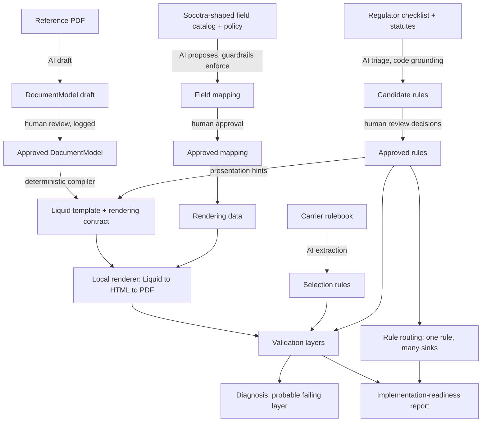

# Architecture

The design rule throughout: **AI interprets, deterministic code compiles and checks, and a person approves.** A model never writes the Liquid template, never picks a data path the catalog doesn't contain, and never approves its own output.

## Stages

1. **Document model (AI draft, human approval).** `analysis/form_analyzer.py` sends the PDF's text blocks and page image to the model, which drafts a reusable template spec: static text, configured values, dynamic fields, repeating groups and sections. A structure review checks the draft against the form and retries once with its findings. Human edits are applied from a logged review file into `sample/schema/document-model.approved.json`. The generated pipeline always starts from an approved model.
2. **Template generation (deterministic).** `templates/generator.py` compiles the approved model into Liquid plus a rendering contract (every key the template reads, with its shape). Approved regulatory presentation rules add hints, such as a prominent hurricane deductible amount.
3. **Data mapping (AI proposes, code enforces).** `mapping/candidate_matcher.py` shortlists catalog paths per field with RapidFuzz. `mapping/ai_mapper.py` has the model choose a path and a transform from a small DSL (`mapping/transforms.py`). Guardrails remove any path not in the catalog, reject unknown transform ops, trial-run every transform against the sample policy, and flag low confidence. Nothing is auto-approved. `mapping/mapper.py` refuses to render if any approved mapping uses a path outside the catalog.
4. **Rules, from ranked sources.**
   - The Florida OIR checklist is parsed deterministically into 150 rows with page and row provenance (`rules/checklist.py`).
   - The model triages every row and structures the declarations-relevant ones (`rules/regulatory.py`). Code then attaches the row text as the quote, verifies citations, attaches statute subsections from the cache (`rules/statutes.py`), verifies prescribed statements against statute text, and limits applicability to predicates it can evaluate against policy data (`rules/applicability.py`).
   - Recorded human review decisions override the model: `sample/rules/regulatory/fl-checklist.review-decisions.json`.
   - A synthetic carrier rulebook drives Document Selection (`rules/extractor.py`, `rules/evaluate.py`).
   - **Rule routing** (`rules/routing.py`): one normative requirement can have several implementation sinks (template, data snapshot, document selection, resource configuration, product configuration, human review). Each route carries its own approval and validation obligations. The routing coverage report lists which obligations have a validator and which don't.
5. **Render (local stand-in for Socotra).** Python Liquid, then PyMuPDF (default) or Playwright (`templates/renderers.py`). The Socotra render adapter is a documented stub. This approximates Socotra's renderer; it is not parity.
6. **Validation, in independent layers.**
   - **Deterministic** (`validation/generated.py`): contract coverage, golden values, key-level values, formatting, static wording, headings, collection counts, row association read from what rendered, page count, page size, blank pages, empty sections.
   - **Carrier rules** (`rules/evaluate.py`): golden selection cases and content rules against the render.
   - **Regulatory traceability** (`rules/traceability.py`): for each rule, it evaluates applicability from policy data, then checks the reference page and the candidate for required values, separation, named items, prescribed statements, and presentation evidence (font size and weight read from the PDF). The verdicts are PASS, FAIL (the reference satisfies the rule and the candidate doesn't), or REVIEW (neither shows it, or applicability is unknown).
   - **Provenance consistency** (`rules/provenance.py`): flags a rule whose cited subsection doesn't match the statute excerpt attached to it. It checks provenance, not law.
   - **Semantic parity** (`validation/semantic.py`) and **visual QA** (`validation/visual.py`): LLM comparisons with code-side grounding filters, plus PDF geometry metrics. These run only when requested.
   - **Diagnosis** (`validation/diagnosis.py`) maps every finding to a probable layer with a heuristic confidence.
7. **Implementation-readiness report** (`bundle/readiness.py`). Every run writes `implementation-readiness.json` and `.md`, combining the document model, mapping, generated artifact, and regulatory routing evidence. Findings are grouped into eight layers:
   - document interpretation
   - data mapping
   - snapshot/transformation
   - template
   - layout
   - document selection/resource configuration
   - regulatory/rule routing
   - human review

   Routing obligations are grouped VERIFIED, REVIEW, NO_VALIDATOR, FAILED, and NOT_APPLICABLE. An obligation with no validator is never reported as verified. See [`examples/implementation-readiness.md`](examples/implementation-readiness.md).

## What is AI and what is deterministic

| Step | AI | Deterministic code | Human |
|---|---|---|---|
| Reference PDF → document model | Drafts the model from text and image | Structure review, schema validation | Reviews and approves the model |
| Model → Liquid template | none | Compiler and rendering contract | none |
| Template fields → Socotra data paths | Chooses a path and transform from a shortlist | Shortlist, catalog guardrails, transform trial run | Approves each mapping |
| Checklist and statutes → rules | Triages rows, structures requirements | Parsing, citation and statute grounding, applicability limits | Review decisions, route approval |
| Carrier rulebook → selection rules | Extracts rules | Evaluates them against golden cases | Approves rules |
| Render | none | Liquid, HTML to PDF | none |
| Validation | Semantic parity, visual QA (optional) | Every other check, the diagnosis, the readiness report | Signs off on layout and open REVIEW items |

## Socotra boundary

Everything Socotra-specific is modelled from Socotra's public documentation and examples; nothing calls a Socotra tenant.

- The field catalog and sample policy are Socotra-shaped demo data.
- The resource manifest, document configuration, and Java plugin sketches (Document Selection, Document Data Snapshot) follow the public docs but are uncompiled.
- The Liquid `data` root is a prototype convention to verify in a tenant.
- The local renderer stands in for Socotra's.

[`ASSUMPTIONS.md`](../ASSUMPTIONS.md) lists every such assumption, and each run copies it with that run's specifics.
